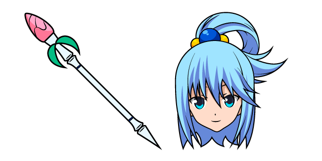

<h2 align="center"><b>Waifu Run</b></h2>

<b>Super Addictive Game with Waifus.</b>

## About

Halo

## Link Mappings

<b>&gt;</b> <a href="https://github.com/00010023/waifu.run/projects/1"> <b>Progress Board</b></a>

<b>&gt;</b> <a href="https://github.com/00010023/waifu.run/projects/2"> <b>Bug Triage</b></a>

<b>&gt;</b> <a href="https://github.com/00010023/waifu.run/discussions"> <b>Discussion</b></a>

<b>&gt;</b> <a href="https://github.com/00010023/waifu.run/issues/new/choose"> <b>Submit an issue</b></a>

<b>Copyright &copy; 2021 <a href="https://uwussi.moe" target="_blank">UwU | 00010023</a></b>

